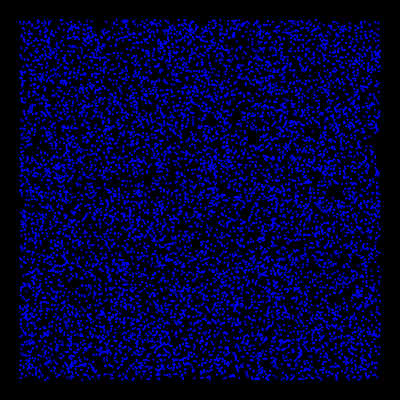
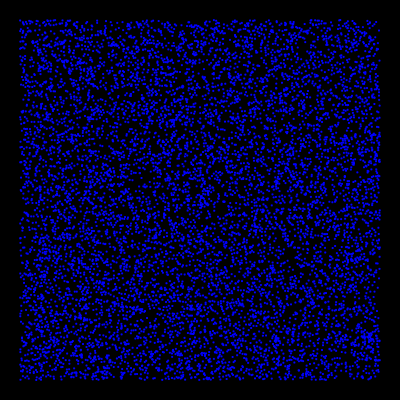

# K-Means

This is is a graphical fun project visualizing the effect of the [k-means](https://en.wikipedia.org/wiki/K-means_clustering) clustering algorithm which is used in data science to analyse many data points into groups.

## Example collage

In the example below you see the colums with 100x100, 200x200, 400x400 and 800x800 datapoints. The rows are the groupsize of 1, 2, 4, 8, 16, 50, 100, 200 and 2000. The images were all rendered in 800x800.


## Example rendering

groupSize 64, 100x100 datapoints  


groupSize 8, 100x100 datapoints  


## Configuration

In this program you can configure some options to influence the graphics produced and to be auto-saved.

The code has at the beginning a configuration section. The options are described below and summarized in the code itself. Default values are included.

- **renderSize**  
To specify the render size set the resolution in the setup() method. For HD with 1280 x 720 call the size() method like below. *Unfortunately this can not be a variable like the others due to [Processing](https://processing.org/) limitation.*  
    ```size(1280, 720);```  

- **groupSize**  
    How many groups to you want to have? Minium is 1, maximum is unlimed, but it makes no sense to take a very high number. These groups will be generated randomly.

- **dataPointSize**  
   How many points to you want? The more you have, the clearer the result will be. Think of it like a screen resolution and better give as a number like x * y (200 * 200). These data points will be generated randomly.

- **paddingSize**  
    This will keep a padding of pixels of painting the groups and data points.

- **blurStrength**  
    After every pass a blur filter is applied. Think of it as an antialiasing value. 2 would affect a 2x2 blurring. Can be 0 if you do not like it.

- **finalBlurStrength**  
    Same as blurStrength, but will be applied at the finish.

- **rotateColors**  
    The color palette is generated for each time. To get a more interesting image, you can enable rotating the color palette. This will run every pass, if enabled.

- **saveImage**  
    The images will be stored into the data directory, when this option is enabled. Filename format is `<timestamp>_gs<groupsize>_dp<datapoints>.png`. That makes it flexible to reuse configuration of the options you like.

- **loopSize**  
    Because of the random factors, every picture will be individual. The points, groups and colors are randomly generated for each run. To make it easy creating lots of pictures and pick the most liked, you can specifiy a number of loops how many pictures should be created. When saveImage is activated, all pictures will be stored in the data directory.
